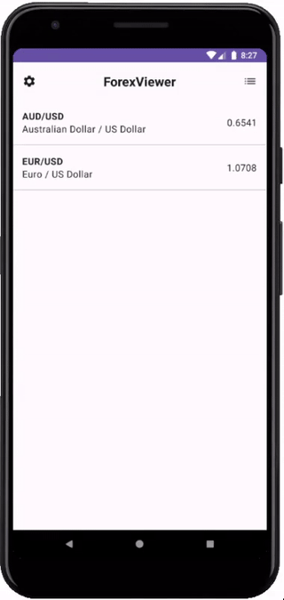
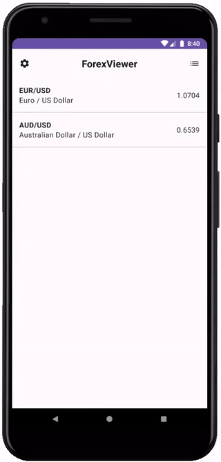
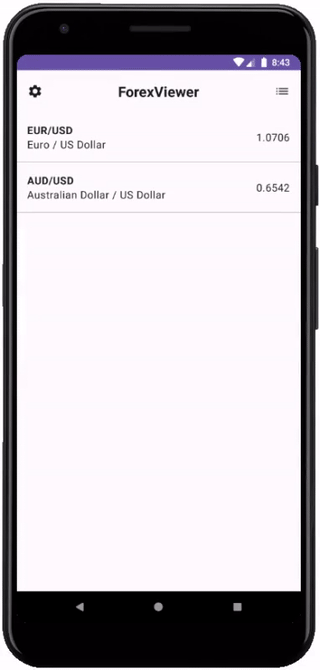

# ForexViewer

A mobile app for forex market monitoring.  
Data provider: https://twelvedata.com  
You can request your own API key at https://twelvedata.com/pricing

&nbsp;

&nbsp;

&nbsp;

## Features

- favorites forex pairs list
- forex pair chart
- available forex pairs list
- add / delete favorites
- manage API key

## Tools

- Compose
- Room
- Retrofit
- Hilt
- JUnit, Robolectric, Kover
