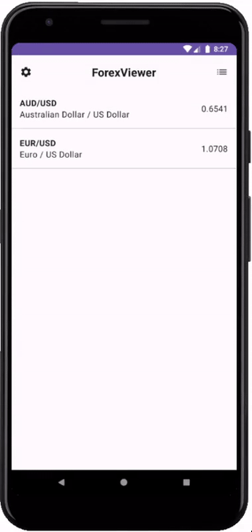
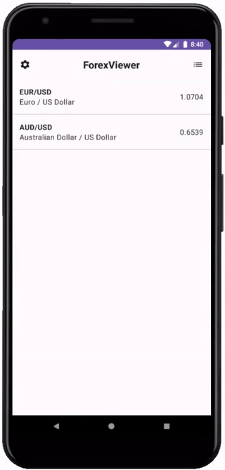
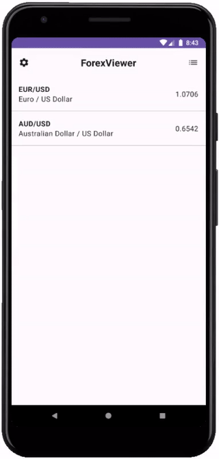
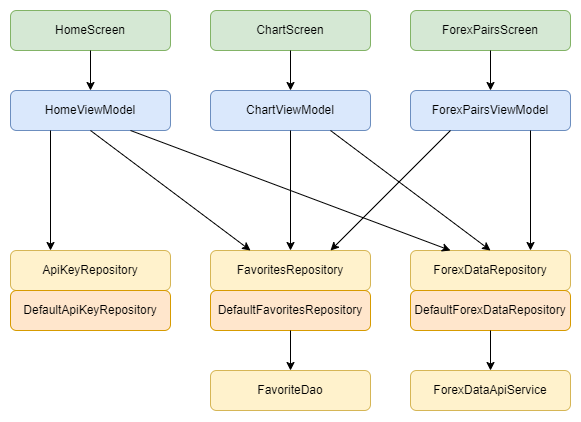

# ForexViewer

Android app for monitoring the forex market. 
Data provider: https://twelvedata.com  
You can request your own API key at https://twelvedata.com/pricing

&nbsp;

&nbsp;

&nbsp;

## Architecture  

&nbsp;

## Features

- list of favorite forex pairs
- forex pair chart
- list of all available forex pairs
- add/remove favorites
- update API key

## Tools

- Compose
- Room
- Retrofit
- Hilt
- JUnit, Robolectric, Kover
